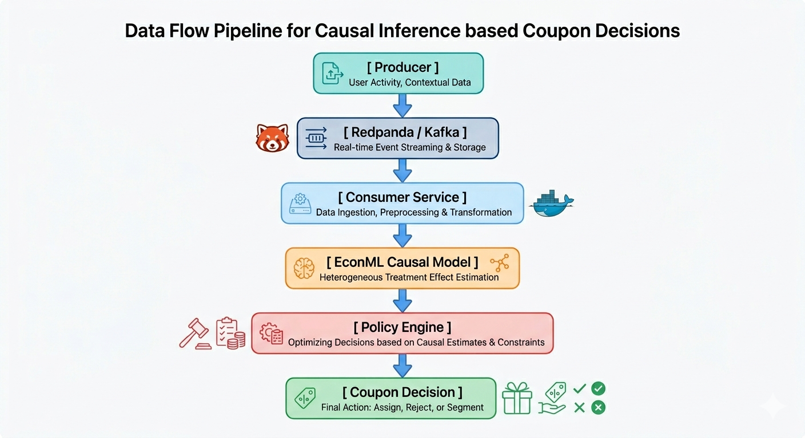

# Real-Time Causal Uplift Modeling System

A real-time causal inference and streaming ML system that predicts customer-specific treatment effects (uplift) to optimize personalized coupon targeting decisions.

Built using:
- EconML CausalForestDML
- FastAPI
- Docker
- Docker Compose
- Redpanda (Kafka-compatible streaming)
- Real-time event-driven inference architecture

---

# Problem Statement

Traditional machine learning predicts:
> "Who is likely to buy?"

Causal uplift modeling predicts:
> "Who will buy *because* of the treatment?"

This system identifies:
- persuadable customers
- wasted discount targets
- optimal coupon allocation strategies

to reduce unnecessary marketing spend.

---

# System Architecture

```text
Producer
   ↓
Redpanda Event Stream
   ↓
Consumer Service
   ↓
CausalForestDML Model
   ↓
Policy Engine
   ↓
Real-Time Coupon Decision
```

---

# Features

- Real-time streaming inference
- Conditional Average Treatment Effect (CATE) estimation
- Personalized coupon policy engine
- Dockerized deployment
- Distributed multi-container architecture
- Kafka-compatible event streaming
- Real-time customer simulation

---

# Tech Stack

| Layer | Technology |
|---|---|
| Causal ML | EconML |
| API Serving | FastAPI |
| Streaming | Redpanda |
| Containerization | Docker |
| Orchestration | Docker Compose |
| ML Framework | scikit-learn |
| Language | Python |

---

# Dataset

Kevin Hillstrom MineThatData E-Mail Marketing Dataset

The dataset contains:
- customer history
- purchase behavior
- marketing treatment groups
- spending outcomes

Used to estimate heterogeneous treatment effects for coupon targeting.

---

# Running The Project

## Clone Repository

```bash
git clone <repo-url>
cd causal-uplift-model
```

## Start Infrastructure

```bash
docker compose up
```

## Run Producer

```bash
python src/streaming/producer.py
```

## Run Consumer

```bash
python src/streaming/consumer.py
```

---

# Example Streaming Inference

```text
Received customer:
{
  "recency": 1,
  "history": 2500,
  "mens": 1,
  "womens": 0,
  "newbie": 1
}

Predicted uplift: 3.89
Decision: SEND_COUPON
```

---

# Business Impact

Instead of sending coupons to all customers, the system estimates:
- who is truly persuadable
- who would purchase anyway
- where discounts would be wasted

This enables:
- reduced marketing spend
- higher campaign efficiency
- personalized treatment allocation

---

# Future Improvements

- Live dashboard visualization
- Cloud deployment
- Online learning
- A/B testing integration
- Real-time monitoring
- Automated retraining pipelines


